# DS-Polynomial - Linked List Homework
## HW - Polynomial ADT, Implementation, and Menu Program Demo

> An abstract data type (ADT) is an object with a generic description independent of implementation details.  Examples of abstract objects include mathematical objects (like numbers, polynomials, integrals, vectors), physical objects (like pulleys, floating bodies, missiles), animate objects (Cats, Velociraptor, People) and objects that are abstract even in the natural language sense. You do not see Java in Cats. Only when you want to simulate a living Cat, you would think of a computer language. Similarly, gravity is an abstract concept. When you want to model it and want to predict how a falling object works, you would think of writing a program in Java.

We can represent a polynomial as an ordered list of terms, where the terms are ordered by their exponents. To add two polynomials,  if the exponent of one is smaller than the exponent of the other, then the larger one comes before the smaller one.  If the exponents are equal, then sum the coefficients (no duplicate terms with same coefficient).  For example:

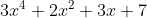 added to 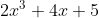 is equal to 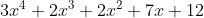

**Create an implementation of the ADT** described above to create and add polynomials.  Begin by defining a class `Term` that contains the exponent and coefficient.  This class should implement the `Comparable` interface by comparing the values of the exponents.  You should build a `Polynomial` class with a `LinkedList<Term>` instance variable, which specifically contains polynomial-related methods (like creating a polynomial, adding two polynomials, etc.).  You need not build your own linked list (homework for next week), use the built in `java.util.LinkedList`.  

**Write a driver/test program** to demonstrate your `Polynomial` ADT implementation, with a menu program that allows a user to:

- edit the first polynomial (clear, create, and add terms)
- edit the second polynomial (clear, create, and add terms)
- display the result of adding the current first and second polynomial (without deleting/modifying those two polynomials)
- exiting the program

The menu will allow the user to modify, clear, build, and add polynomials repeatedly until they choose to exit the program.  Also, the user should be able to enter terms for a polynomial in whatever order they’d like (ex: 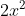 then 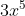 then ; or if have user enter it all at once as 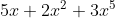) and the polynomial should be stored, output, and maintain proper order (ex: 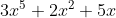).  You can assume the user will enter the terms/polynomials in whatever clear instructions you give them (*extra credit for not assuming this and using exception handling*).

**Provide full UML class relationship diagram for the project above as well as a UML sequence diagram for your driver**. Save both as images and place inside the `doc` package of the repository, then edit this markdown file to add the images in the placeholders below:

----------

Polynomial Program – UML Class Relationship Diagram

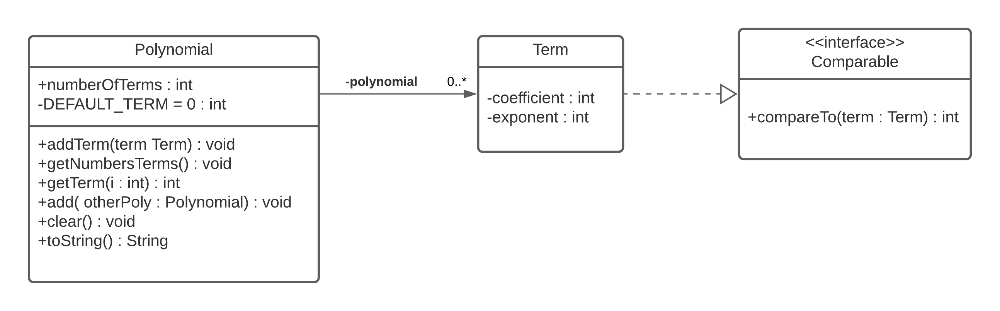

Polynomial Program – UML Driver Sequence Diagram

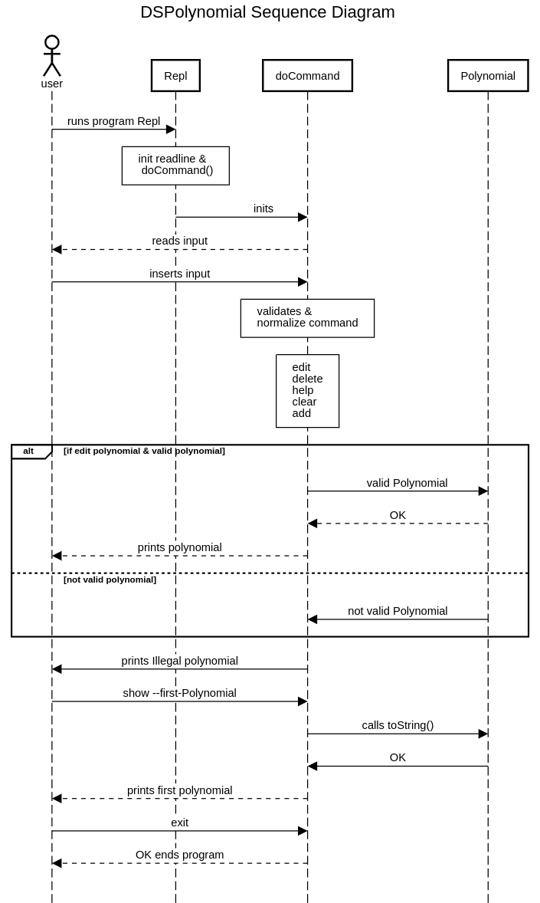

----------

## Usage:

The program should be excuted from a terminal. Don't run the program on the IDE.
The ide runs a dump terminal and the REPL input does not work.
Follow the next steps to run the program.

1. For eclipse IDE go to Run configurations > select Main > show Command Line > copy & close

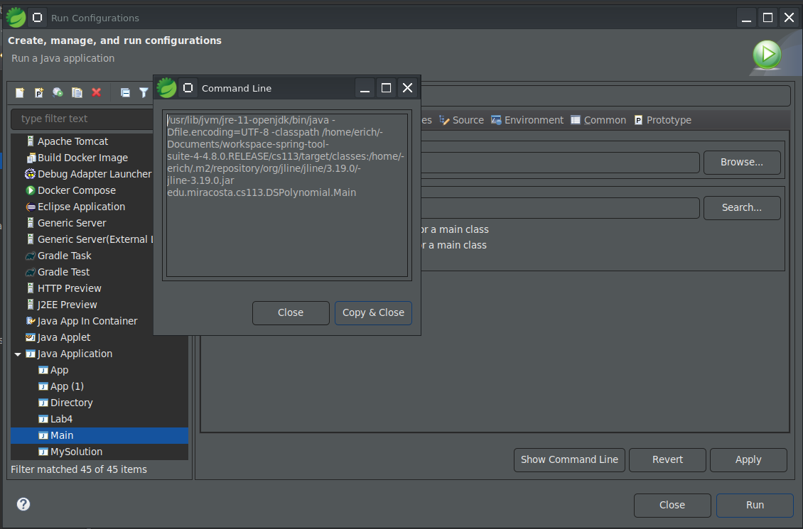

2. Open a terminal and paste the command to run the program.

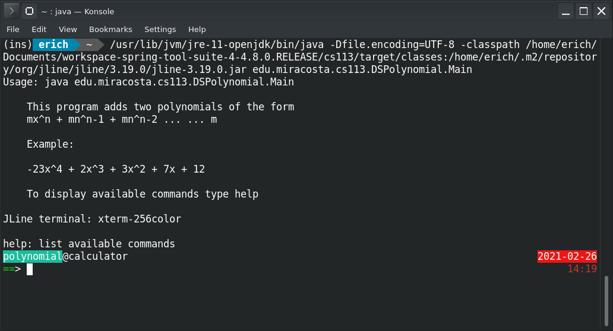

### Example usage:

