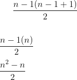

# Big-O notation 


1.  **O(0)**
2.  **O(5)**
3.  **O(2/N)**          //   { n | n > 0 } the set of all natural numbers such as n > 0 
4.  **O(log N)**
5.  **O(sqrt(N))**      // sqrt(N) = N ^ 1/2 
6.  **O(N)**            
7.  **O(N^1.5)**
8.  **O(N log N)**
9.  **O(N^2)**
10. **O(NM)**       //      { n | m > n  } the set of all natural numbers such as m > n   
11. **O(N^4)**
12. **O(2^N)**
13. **O(INFINITY)**

O(f(n)) | f(50) | f(100) | f(100) / f(50)
--------|-------|--------|--------------
O(0)    |   0   |    0   |   0 
O(5)    |   5   |    5   |  5 
O(2/n)  |   0.04|    0.02   |  1/2
O(log n)    |   5.64   |   6.64    |  1.18 
O(sqrt(n)) | 7.07 | 10 | 1.41 
O(n) | 50 | 100 | 2
O(n^1.5) | 353.55 | 1000 | 2.82
O(n log n) | 282 | 664 | 2.35
O(n^2) | 2500 | 10000 | 4 
O(nm) m = 60 | 3000 | 60000 | 20
O(n^4) | 6.25 x 10^6 | 1 x 10 ^ 9| 1.6x10^14
O(2^n)| 1.125 x 10 ^15 | 1.267  x 10 ^30 | 1.12 x 10^45
O(INFINITY) | --- | --- | --- 


## Big-O Time complexity

* Total number of steps is given by n so 
T = { 1 + 1 + 1 ... n } n times \
\
<a href="https://www.codecogs.com/eqnedit.php?latex=t(n)&space;=&space;O(n)" target="_blank"></a>

```java
int sum = 0;
for ( int = 0 ; i < n ; i++ ) {   // N times
    sum++;
}
```

* Two loops the inner loop is repeated n times by the
n times of the outer loop.
\
\


```java
int sum = 0;
for ( i = 0 ; i < n ; i++ ){                  //  N times
	for ( int j = 0 ; j < n ; j++ ){      // N times
	 	sum++;
	}
}

```

* Two loops the first loop is repeated n times
the inner loop grows by 1 following the natural number
series pattern { 1, 2, 3 ... ...n }  to get the total number
we use the next formula  \
To get the total steps we multiplie the outer loop by the inner loop:\
\

```java
int sum = 0;
for ( i = 0 ; i < n ; i++ ){                  //  N times
	for ( int j = 0 ; j < i ; j++ ){      //  { 1 + 2 + 3 ... ... n } Sum of the first n number of the series 
	 	sum++;                        //  n ( n+ 1) /2
	}
}


```

* Two loops
The first loop is repeated n * n times, the inner loop is repeated n * n times
To get the total steps and time complexity:


```java
int sum = 0;
for ( i = 0 ; i < n*n ; i++ ){                  //  N * N times
	for ( int j = 0 ; j < n * n ; j++ ){      // N  * N times
	 	sum++;
	}
}

```

