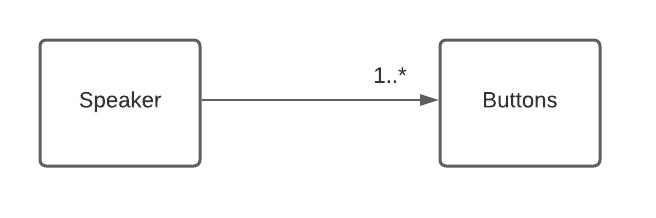
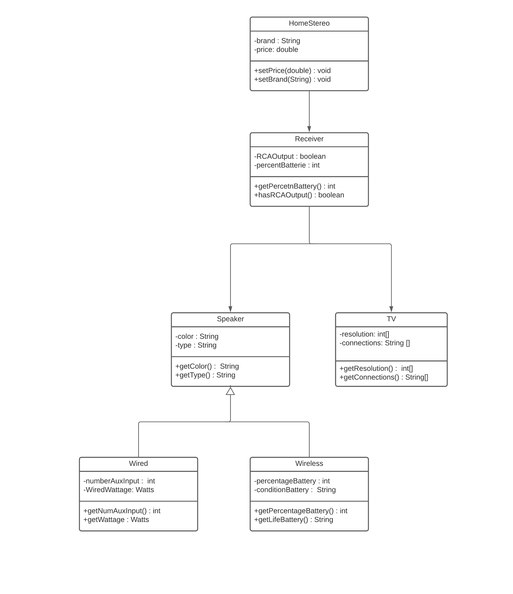

# Home Stereo UML Modeling

## Association vs Aggregation vs Composition

Associations represent static relationships between classes. It can
be represented by a line between theses classes with an arrow indicating
the navigation direction. It can be adorned with multiplicity signs.
The example indicates that speaker should have at least one or more buttons.

A single speaker can be associated with multiple buttons( actions to perform over speaker class)

 

 
 
Aggregation and composition are subsets of association meaning they are specific 
cases of association.

Aggregation implies a relationship where the contained class can exist independently of the parent.
In other words the aggregation link usually is used to stress the point that the parent
class instance is not the exclusive container of the class child instance, the child class instance has another container/s.
This modeling has not aggregation relationship becuase if the class Home stereo is deleted all the classes are deleted as a result. No other container ( class ) uses the other contained classes.

Composition implies a relationship where a relationship between two classes cannot exit independently from each other. 
Compisite has the next characteristics:
* It is a two-way association between the objects.
* It is a whole/part relationship
* If a composite is deleted, all other parts associated with it are deleted

Example the Stereo receiver class has a dependency with the whole class
Home stereo. Whitout an amplifier the other classes are useless. (TV source, Speaker)

Generalization is another name of inherence is a mecanism for combining similar classes of object in a single, more general class.
Example the speaker class can be of two different types a wireless and a wired speaker.
 
 

