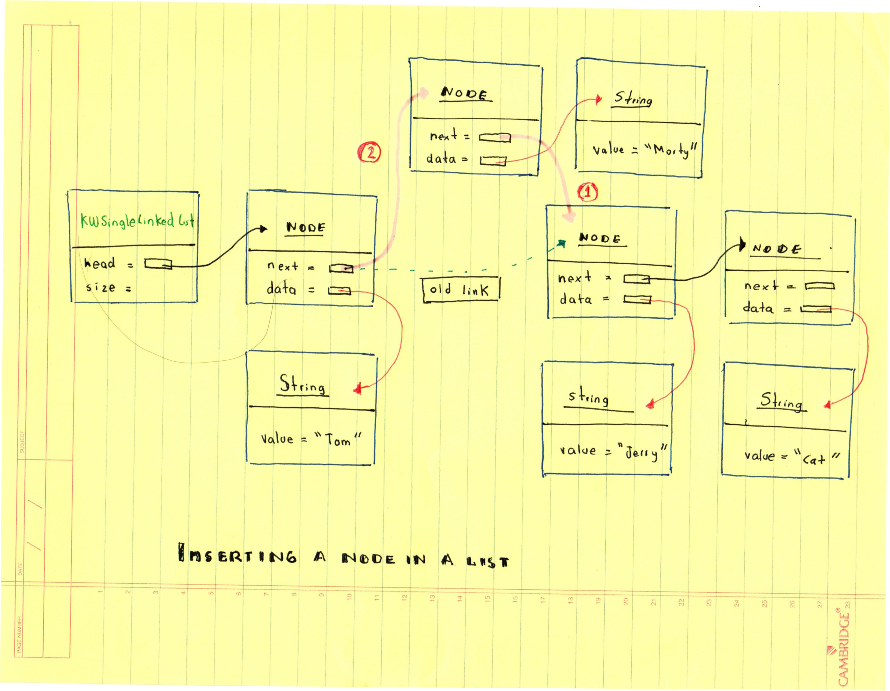
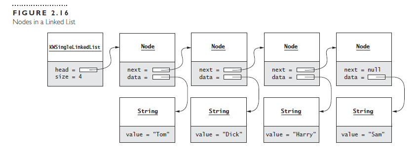

# Inserting a node in a list

## LinkedList operations





a) Insert "Bill" before "Tom"


```java
public void addFirst(E data){
	head =  new Node<E>(data,head);
	size++
}


```


b) Insert "Sue" before "Sam"

```java

private void addAfter(Node<E> prevNode ,E data){
	prevNode = new Node<E>(data , prevNode.next);
	size++;
}
```


c) Remove "Bill"

```java
private void removeFirst(){

	if ( head != null ){
		head = head.next;
		size--;
	}

}


```


d) Remove "Sam"


```java
private void deleteTail(){


	Node<E> nodeRef = head;
	Node<E> prevNode = null;
	while ( nodeRef != null ){
		prevNode = nodeRef;
		nodeRef = nodeRef.next;
	}

	if ( prevNode == null ){
	   return;
	}
	prevNode = new Node<E>(prevNode.data);
	tail = prevNode
	size--;
}

```


## SELF-CHECK

1. What is the big-O for the single-linked list get operation?  O(n)
2. What is the big-O for the set operation? O(1)
3. What is the big-O for each add method? add(E) is O(1) add(index,E) is O(n)
4. Draw a single-linked list of Integer objects containing the integers 5,10,7
   and 30 and referenced by head. Complete the following fragment, wich adds all Integer 
   objects in a list. Your fragment should walk down the list, adding all integer values to
  sum.


```java
   
int sum = 0 ;
Node<Integer> nodRef  = head;
while (nodeRef != null){
	int next = nodeRef.item;
	sum += next;
	nodeRef = nodeRef.next;

}
```


5. For the single-linked list in Figure 2.16, data field head (type Node) references the first
node. Explain the effect of each statment in the following fragments.

a) 

```java
 head = new Node<String>("Shakira", head.next);  // inserts Shakira as the new head
```
b)

```java
node<String> nodeRef = head.next; // nodeRef --> points to the second Node
nodeRef.next = nodeRef.next.next; // nodeRef --> points to the 3th Node and it is assigne the 4th node 			          	  // the 4th Node.
				  // 3th Node = 4th Node

```


c)

```java
Node<String> nodeRef = head;
while ( nodeRef.next != null )                 // loops until next is null
	nodeRef = nodeRef.next;                // next node
nodeRef.next = new Node<String>("Tamika");     // null found the last node now is "Tamika"
```


d)


```java
Node<String> nodeRef = head;                  //nodeRef is pointing to the first Node
while ( nodeRef != null && !nodeRef.data.equals("Harry") ) //Loops ends until Harry is found or
	nodeRef = nodeRef.next;                            // nodRef is null
if (nodeRef != null ){                      //Checks if nodeRef is not null

   nodeRef.data = "Sally";      //Replaces "Harry" for "Sally"
   nodeRef.next = new Node<String>("Harry",NodeRef.next.next); //nodeRef.next is replaced with a 
							      // new node."Harry" as the new 
							//data and nodeRef.next.next points to null. That makes 
							//"Harry" the last element of the list. 
}

```


   
   

